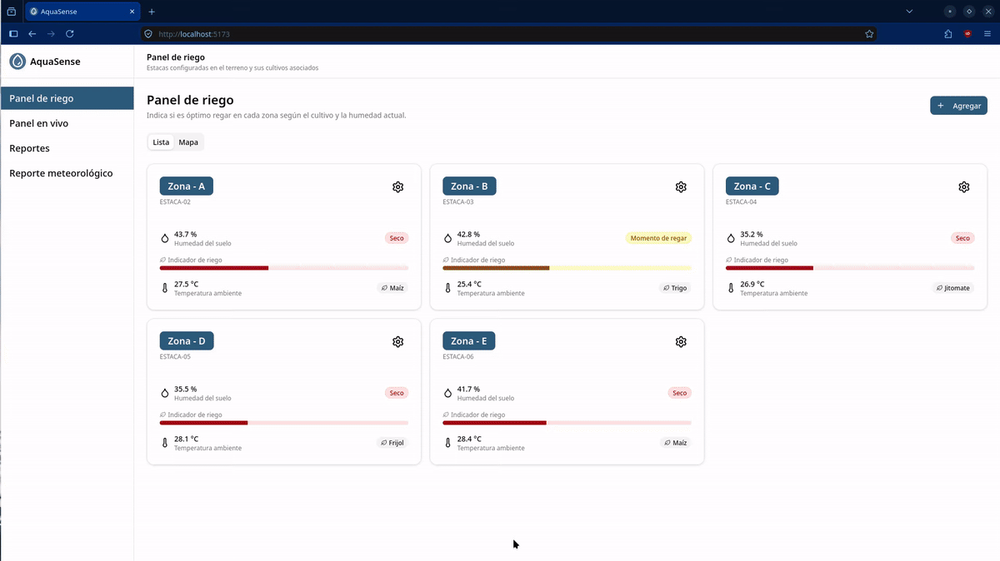
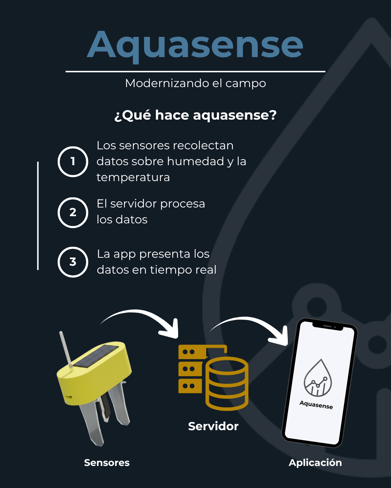

# Aquasense
Junto con mi mejor amigo el ing. civil [Joseph A. Murcio](https://www.linkedin.com/in/joseph-abraham-murcio-marquez-78b136296/) ganamos el **🥇1er lugar del concurso nacional de desarrollo de aplicaciones con temática del agua**. 

El evento estuvo organizado por la [Asociación Mexicana de Hidráulica](https://amh.org.mx/) con sede en Tijuana. Nuestra propuesta se enfoco en el sector agronómo, ya que en México consume +70% del agua potable. Así que diseñamos un producto dirigido a los agricultores que usan la técnica de riego por inundación. 

<p align="center">
   </img>
</p>

El valor que aporta **Aquasense** es que le permite al agricultor monitorear en tiempo real el nivel de humedad y temperatura mediante la instalación de módulos dentro del campo. Y en base a información tomar decisiones, ejemplo: "debo regar más esta zona", "hoy no voy a regar" o "debo cambiar de cultivo por las condiciones del terreno".  

## Funcionalidades
- Monitoreo invidual de los módulos
- Mapa global de monitoreo
- Histórico en tiempo real de temperatura y humedad
- Notificación del sistema metereológico nacional

## Infografía
<p align="center">
   </img>
</p>

# Ejecutar proyecto
## 1. Clonar proyecto

```shell
git clone https://github.com/TacticalOnion/aquasense.git
```
## 2. Inicializar ESP32
1. Abrir `esp32/aquasense/aquasense.ino` en Arduino IDE.
2. Instalar las siguientes librerias
   1. Adafruit AHTX0
   2. Adafruit BusIO
   3. Adafruit GFX Library
   4. Adafruit SH110X
   5. Adafruit  Unified
3. Seleccionar la board `ESP32 Dev Module`
4. Seleccionar el port que quieras en `Tools>Port`. 
5. Conectar la ESP32 mediante puerto USB o C
6. Cargar `aquasense.ino` en la ESP32 haciendo click en `Upload` (icono ->).

## (Opcional): crear datos prueba
1. Accede al backend
```
cd backend
```

2. Ejecuta el siguiente script
```shell
npx ts-node ./src/scripts/generateTestData.ts
```

## 3. Inicializar backend
1. Accede al backend.

```shell
cd backend
```

2. Instalar dependencias.

```shell
npm install
```

3. Definir el puerto seleccionado de comunicación como variable de entorno.

```shell
# Ejemplo: COM7
$env:SERIAL_PORT_PATH="COM_SELECCIONADA"
```

4. Ejecutar backend.

```shell
npm run dev
```

> [nota]: El servicio se ejecutará en la terminal y solo se finalizará oprimiendo `cntrl + c`.

## 4. Inicializar frontend
1. Acceder al frontend desde otra terminal.

```shell
cd frontend
```

1. Instalar dependencias.

```shell
npm install
```

2. Ejecutar frontend. 

```shell
npm run dev
```

> [nota]: El servicio se ejecutará en la terminal y solo se finalizará oprimiendo `cntrl + c`.

## 5. Acceder a la app web
1. Acceder a la app web desde el navegador en la siguiente ruta `http://localhost:5173/`.
